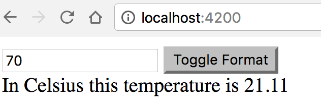

=== *_Custom pipes_*

In addition to predefined pipes, you can create custom pipes, which can include code specific to your application. You need to create a `@Pipe()` decorated class that implements the `PipeTransform` interface. The `PipeTransform` interface has the following signature:

[source, js]
----
export interface PipeTransform {
  transform(value: any, ...args: any[]): any;
}
----

This tells us that a custom pipe class must implement just one method with the preceding signature. The first parameter of `transform` takes a value to be transformed, and the second defines zero or more parameters required for your transformation algorithm. You specify the name of the pipe to be used in  templates in the `name` property of the `@Pipe()` annotation.

If your component uses custom pipes, they have to be explicitly listed in the `declarations` property of `@NgModule()`.

Let’s create a custom pipe that can convert the temperature from Fahrenheit to Celsius and back. Start generating a new project, then change to its direcory and generate a pipe by running the following commands:

[source, sh]
----
ng new pipes --minimal
cd pipes
ng g p temperature
----

The last command will add `TemperaturePipe` to the `declarations` array of the app module and will generate the following class in the src/app directory of your project:

[source, js]
----
@Pipe({
  name: 'temperature'
})
export class TemperaturePipe implements PipeTransform {

  transform(value: any, args?: any): any {
    return null;
  }
}
----

The code of our custom `TemperaturePipe` pipe can be used in a template as `temperature`, and now we need to modify the generated `transform()` method to include the algorithm for the temperature transformation. Our pipe will take an  argument `fromTo` that will specify if we want to convert the temperature from from Fahrenheit to Celsius or in the opposite direction.

[source, js]
----
@Pipe({name: 'temperature'}) // <1>
export class TemperaturePipe implements PipeTransform {

    transform(value: any, fromTo: string): any { 

        if (!fromTo) { // <2>
          throw new Error("Temperature pipe requires parameter FtoC or CtoF");
        }

        return (fromTo == 'FtoC') ?
                  (value - 32) * 5.0/9.0:  // F to C
                   value * 9.0 / 5.0 + 32;  // C to F
    }
}
----

<1> The name of our pipe is temperature, and it can be used in the component’s template. 

<2> If this pipe is used without providing a format, we throw an error. An alternative approach would be to return the provided value without transformation.

Update the code of the generated app.component.ts to use our  `temperature` pipe. Initially this component will convert the temperature from Fahrenheit to Celsius (the `FtoC` format). By clicking the toggle button, you can change the direction of the temperature conversion.

[source, js]
----
@Component({
  selector: 'app-root',
  template:`<input type='text' value="0"
                   placeholder= "Enter temperature" [(ngModel)] = "temp">
  <button (click)="toggleFormat()">Toggle Format</button>
   In {{targetFormat}} this temperature is {{temp | temperature: format | number:'1.1-2'}}` // <1>

})
export class AppComponent {

  temp: number;
  toCelsius: boolean=true;
  targetFormat: string ='Celsius';
  format: string='FtoC'; // <2>

  toggleFormat(){ // <3>

    this.toCelsius = !this.toCelsius;
    this.format = this.toCelsius? 'FtoC': 'CtoF';

    this.targetFormat = this.toCelsius?'Celsius':'Fahrenheit';
  }
}
----

<1> Chains our temperature pipe with Angular’s number pipe to display the resulting temperature as a number having at least one digit before the decimal point and up to two digits after.

<2> The initial value, FtoC, will be passed as a parameter to our temperature pipe 

<3> When the user clicks on the toggle button, switch the conversion direction and change the output text accordingly.

The template of our component uses two-way binding (explained later in this chapter) with a help of the directive `ngModel`. This directive is a part of Angular Forms API (see chapter 7), and we need to include the FormsModule in the module imports:

[source, sh]
----
@NgModule({
  imports: [
    BrowserModule,
    FormsModule
...
})
export class AppModule { }
----

Run this app with `ng serve` and you'll see a window that allows to enter the value in one temperature system and convert to another as shown on Figure 2-1:

.Running the temperature pipe app
